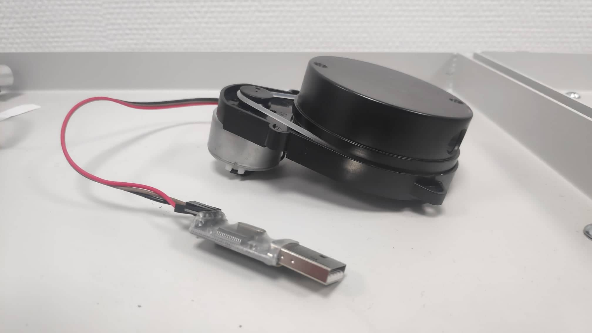
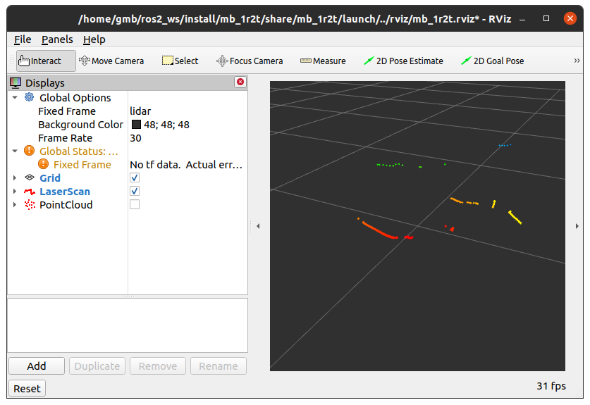

# mb_1r2t_ros2

ROS2 driver for the MB 1R2T LiDAR.

Based on [https://github.com/Vidicon/mb_1r2t_ros](https://github.com/Vidicon/mb_1r2t_ros).





## Usage

In order to launch the node:

```bash
ros2 launch mb_1r2t start.launch.py
```

In order to launch the node and see the results via ```rviz```:

```bash
ros2 launch mb_1r2t rviz.launch.py
```

## Notes

By default the node publishes to the following topics:

| Topic | Type |
|-------|------|
|```/laser_scan``` | ```sensor_msgs/msg/LaserScan```|
|```/point_cloud``` | ```sensor_msgs/msg/PointCloud```|

The default parameters of the node are:

+ ```port``` (serial port) = ```/dev/ttyUSB0```

+ ```frame_id``` = ```lidar```

These can be changed using the launch file *launch/start.launch.py*.

Windows is not supported yet.
